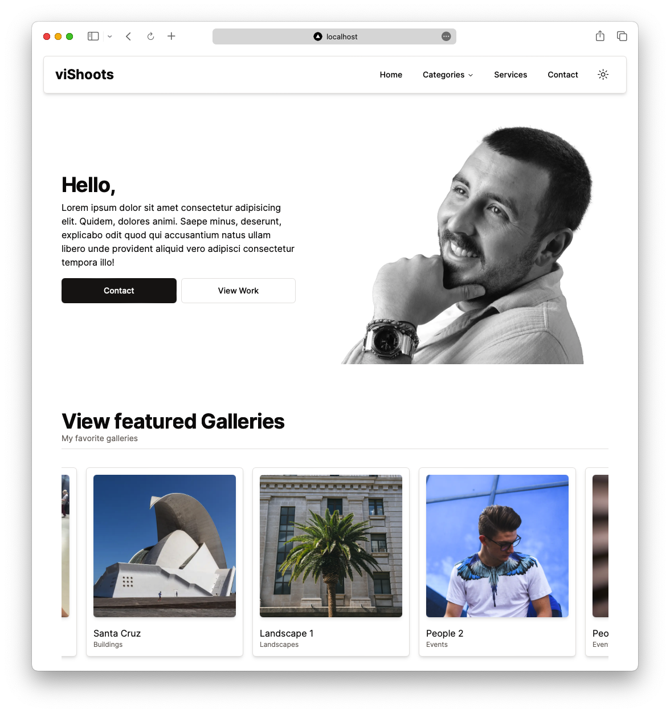
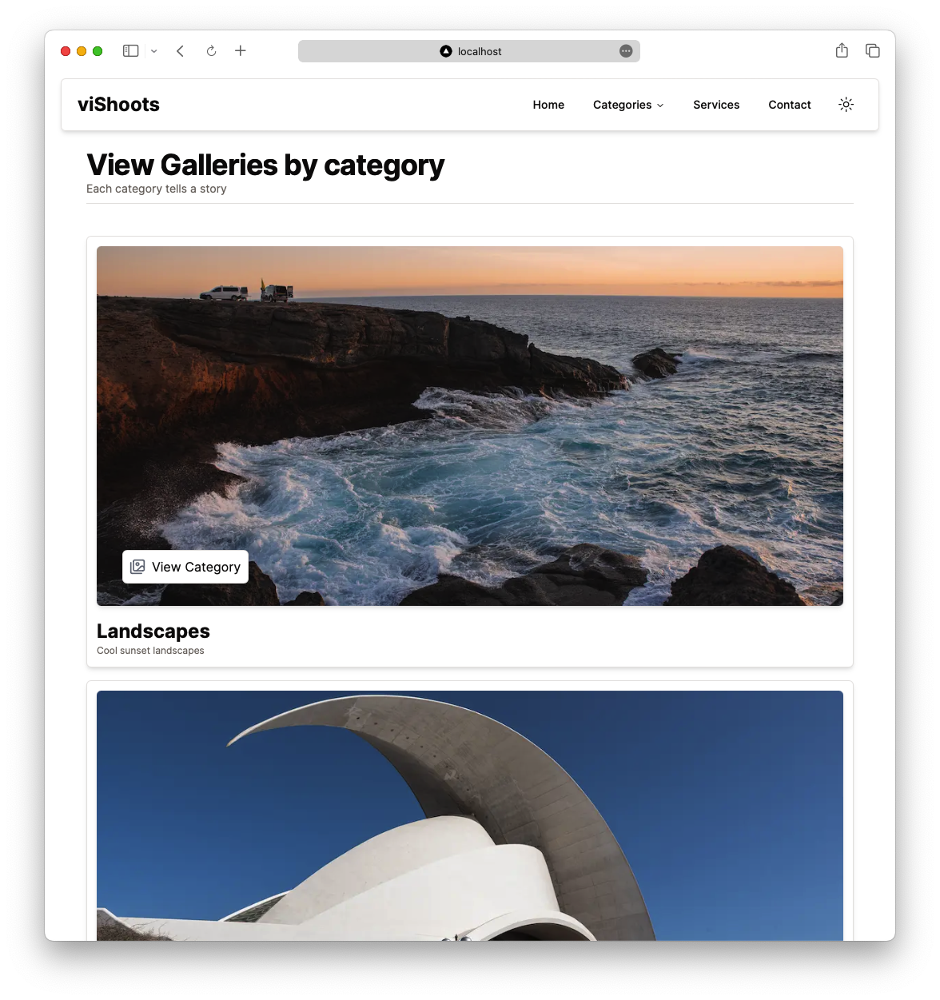
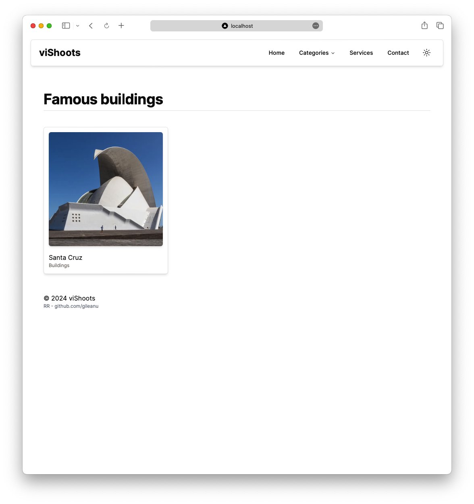
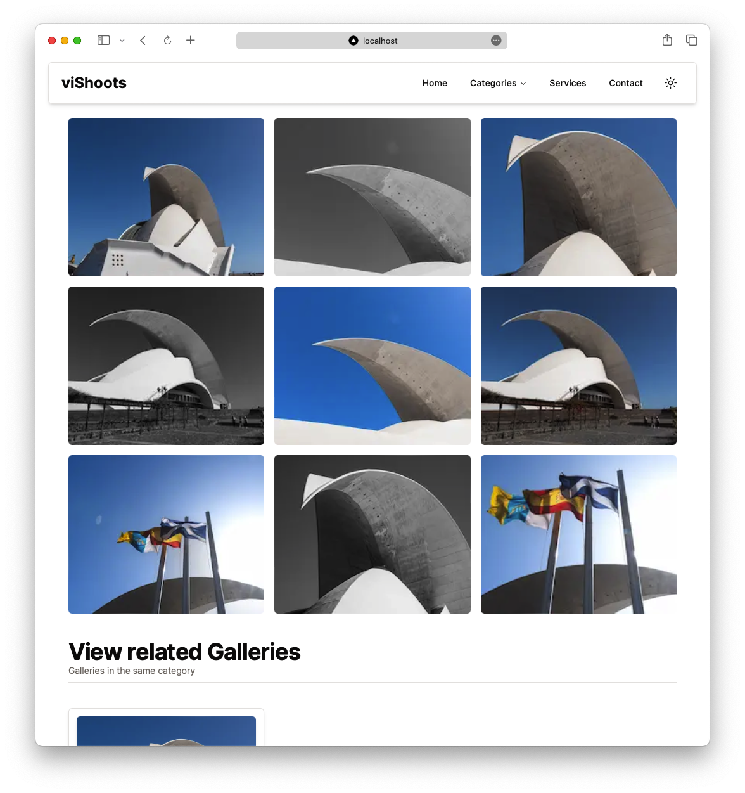

# viShoots

## Platform for Showcasing Photography Work

Full-stack website designed to elegantly display a photography portfolio. Initial idea for this website was [Antonio Erdeljac](https://github.com/AntonioErdeljac) video on how to build a [Full-stack E-Commerce website and Admin dashboard](https://www.youtube.com/watch?v=5miHyP6lExg).

For a behind-the-scenes look at how everything works, check out the [viShoots-admin repository](https://github.com/gileanu/vishoots-admin).

### Key Features:

- **Fast and Responsive:**
- **Animated with Framer Motion:**
- **Page Structure:**
- **Contact Page with Form:**

### Built using: Next.js with React, TypeScript and the App router, TailwindCSS, Prisma with Supabase

## Sitemap:

#### Homepage / Landing Page

Currently mostly static, only dynamic section is the "Featured Galleries" section.

TODO: Create a setup page redirect after user added Portfolio name for: "About me" and "Work" sections - Admin Dashboard

#### Categories

TODO: Animate all categories

#### Categories / Category

#### Categories / Category / Gallery

TODO: Find a better way to showcase all Gallery images

TODO: Implement lightbox or carousel for Gallery Images

#### Services : TODO

#### Contact: TODO
